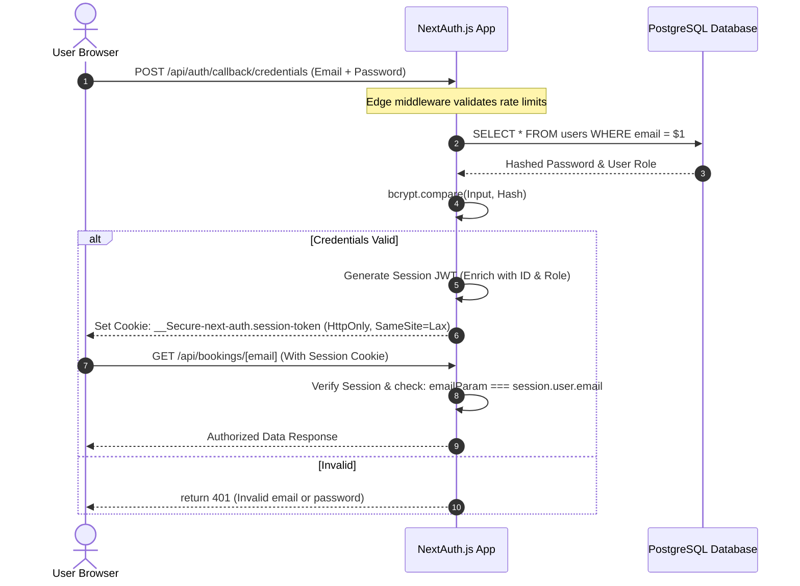
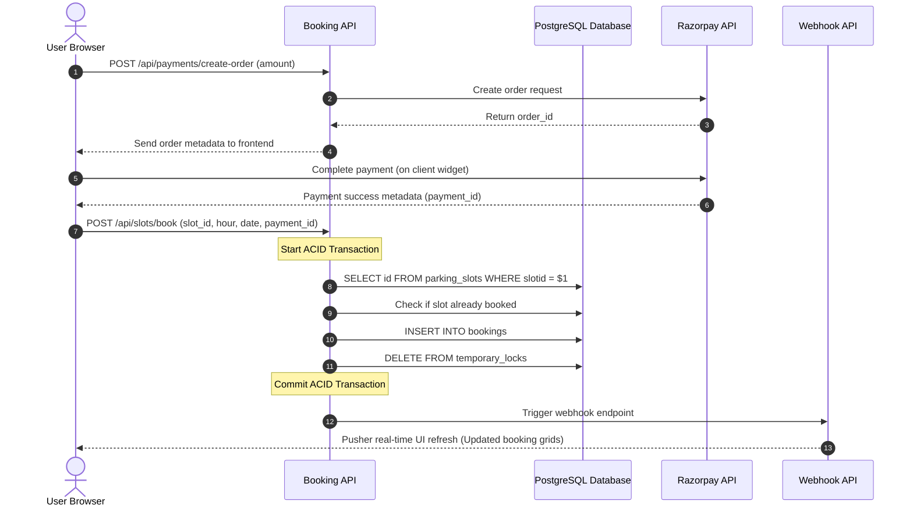

# 🏛️ Smart Parking System — Architecture, Flows & Security Guide

This document provides a detailed breakdown of how the authentication, booking transactions, payment gateway, rate limiting, and security mechanisms are designed and integrated within the application.

---

## 📋 Table of Contents
1. [🔐 Authentication & Session Flow](#1-authentication--session-flow)
2. [💳 Booking, Payment & Webhook Flow](#2-booking-payment--webhook-flow)
3. [⚡ Edge-Layer & API Rate Limiting](#3-edge-layer--api-rate-limiting)
4. [🐘 PostgreSQL ACID Transaction Locking](#4-postgresql-acid-transaction-locking)
5. [🛠️ Architectural Design Decisions](#5-architectural-design-decisions)
6. [🛡️ Cyber-Attack Defense Mechanisms](#6-cyber-attack-defense-mechanisms)

---

## 1. 🔐 Authentication & Session Flow

The application utilizes **NextAuth.js** (v4) to manage user identity. It supports three authentication channels:
1. **Credentials Provider:** Conventional email & password credentials verification.
2. **Google OAuth 2.0:** Single sign-on authentication through Google.
3. **GitHub OAuth 2.0:** Single sign-on authentication through GitHub.

### 🔄 The Authentication Pipeline



### 🔑 Key Design Details:
* **Session Strategy:** JSON Web Tokens (JWT) signed with `NEXTAUTH_SECRET` are used. No session state is held on the server; the token is stored inside a secure cookie.
* **Cookie Security:** The token cookie has `HttpOnly` enabled (preventing client-side JavaScript access to block XSS attacks) and utilizes `SameSite=Lax` to prevent Cross-Site Request Forgery (CSRF).
* **Role Verification:** User roles (`user`, `admin`) are populated from the DB during login and stored in the JWT payload. Gated routes (such as admin top-ups) verify `session.user.role === 'admin'` before fulfilling API requests.

---

## 2. 💳 Booking, Payment & Webhook Flow

When booking a slot, the system supports payment via a digital wallet (pre-credited via administrative approval) or direct card transaction using the Razorpay gateway.

### 🔄 The Order & Booking Lifecycle



### 💳 Webhook Handling:
* Live status checks use **Pusher** webhooks to instantly notify other connected clients when a slot gets reserved. This prevents two different users from viewing a slot as "available" at the same time.

---

## 3. ⚡ Edge-Layer & API Rate Limiting

Serverless environments require defensive rate limiting to prevent bots from crashing APIs or causing massive execution cost spikes.

### 🛡️ Two-Tiered Defense:

```
                  ┌──────────────────────────────┐
                  │      Incoming API Request    │
                  └──────────────┬───────────────┘
                                 │
                 Is path "/api/auth/callback"?
                                 │
                   ┌─────────────┴─────────────┐
                  Yes                          No
                   │                           │
         ┌─────────▼─────────┐       ┌─────────▼─────────┐
         │  middleware.js    │       │  lib/ratelimit.js │
         │  (Vercel Edge)    │       │  (Next.js Route)  │
         └─────────┬─────────┘       └─────────┬─────────┘
                   │                           │
                   └─────────────┬─────────────┘
                                 │
                   ┌─────────────▼─────────────┐
                   │  Redis REST Check (incr)  │
                   └─────────────┬─────────────┘
                                 │
                       Allowed / Blocked?
                                 │
                   ┌─────────────┴─────────────┐
                 Yes                          No
                   │                           │
          ┌────────▼─────────┐        ┌────────▼─────────┐
          │ Execute Endpoint │        │   Return HTTP    │
          │     & DB Query   │        │   429 Too Many   │
          └──────────────────┘        └──────────────────┘
```

1. **Edge-Layer Middleware (`middleware.js`):**
   * Placed in front of `/api/auth/callback/credentials` to catch login brute-forcing.
   * Runs at the CDN edge level using Vercel Edge Runtime. It executes in milliseconds, validating the rate-limit state in Redis before the serverless API container even starts up.
   * Limit: **10 attempts / 15 minutes** per IP.

2. **Route-Level Rate Limiter (`lib/ratelimiter.js`):**
   * Placed inside API routes like `/api/register`, `/api/contact` and `/api/lots`.
   * Limit examples: **5 attempts / 10 minutes** for registration; **5 attempts / 15 minutes** for RAG chatbot support.

### 🔌 Why Upstash Redis?
Unlike traditional Redis which keeps long-running TCP sockets open (which fails or exhausts resources under serverless scaling), Upstash handles database queries over HTTP REST requests. This allows the system to remain highly performant even under spikes of traffic.

---

## 4. 🐘 PostgreSQL Concurrency & Locking Mechanics

Your system uses a **two-phase locking strategy** to guarantee that slots are held during checkout and successfully booked without double bookings. 

---

### Phase A: The 5-Minute Checkout Hold (Persistent DB Table)
When a user clicks "Book" and is redirected to the Razorpay widget, we need to temporarily reserve the slot for **5 minutes** so no one else can purchase it.

* **Why we do NOT use raw in-memory locks here:**
  If we used a database transaction block (`BEGIN` ... `FOR UPDATE`) and kept it open for 5 minutes waiting for the user to type their card details, we would hold a PostgreSQL connection open. This would quickly starve the server's connection pool, block all other database queries, and crash the website under load.
* **The Solution:** 
  We write a short-lived row to the `temporary_locks` table containing a `booking_date`, `booking_hour`, and an `expires_at` timestamp set to `now() + interval '5 minutes'`.
  * A database unique constraint on `(slot_id, booking_date, booking_hour)` ensures that only one checkout hold can exist at a time.
  * An automated background check / cleanup query purges expired locks regularly.

---

### Phase B: Instantaneous Row-Level Locking (`FOR UPDATE` in shared RAM)
Once the payment succeeds, the application executes the booking insertion. This query is completed in **milliseconds** and uses PostgreSQL's native transaction block and **in-memory row-level locks**.

When a user submits `/api/slots/book`, the database execution is wrapped in a strict transaction:

```sql
BEGIN;

-- 1. Check if the slot and hour are already booked, locking the row in PG shared memory
SELECT id 
FROM bookings 
WHERE slot_id = $1 AND booking_date = $2::date AND booking_hour = $3 
FOR UPDATE;

-- 2. If rowcount is 0, safely insert the confirmed booking
INSERT INTO bookings (slot_id, booking_hour, email, booking_date, payment_id)
VALUES ($1, $2, $3, $4::date, $5);

-- 3. Delete the temporary checkout hold row
DELETE FROM temporary_locks 
WHERE slot_id = $1 AND booking_date = $2::date AND booking_hour = $3;

COMMIT;
```

### 🔒 Key Safeguards in Phase B:
* **`FOR UPDATE` (In-Memory Locking):** This locks the matching rows in PostgreSQL's shared memory (RAM). If two checkout webhooks hit the server at the exact same millisecond, the first query blocks the second until the first transaction commits.
* **Double Booking Prevention:** Once the first transaction commits, the second transaction sees the slot is already booked and fails validation, rolling back cleanly without corrupting database integrity.

---

## 5. 🛠️ Architectural Design Decisions

| Challenge | Old Approach | New Optimized Approach | Why? |
|-----------|--------------|------------------------|------|
| **DB Performance** | MongoDB Mongoose queries | Raw parameterized queries | Bypasses ORM bootstrap times. Decreases serverless boot latency. |
| **Double Bookings** | Redis-based queues | PostgreSQL Row Locking | Eliminates dependency on external queues for data consistency. Relies on DB constraints. |
| **Tab-switching Latency** | Re-fetch API endpoints on tab clicks | Client-side page states | Caches active UI tabs (`hasLoadedBookings`) so navigating does not trigger duplicate SQL query execution. |
| **Serverless Connections** | Persistent Redis connections | REST HTTP Redis (Upstash) | Avoids connection exhaustion under serverless edge runtime. |

---

## 6. 🛡️ Cyber-Attack Defense Mechanisms

### 💉 SQL Injection (SQLi)
* **Defense:** Raw input strings are never interpolated directly into queries. We use parameterized placeholders (`$1, $2`).
* **Example:** `SELECT * FROM users WHERE email = $1` instead of `"SELECT * FROM users WHERE email = '" + email + "'"`

### 🪓 Cross-Site Scripting (XSS)
* **Defense:** React handles automatic output HTML encoding on values injected into JSX templates. 
* **Defense:** Implemented a strict **Content Security Policy (CSP)** inside `next.config.mjs` which forbids unapproved third-party scripts or injected inline script elements from executing.

### 🛡️ IDOR (Insecure Direct Object Reference)
* **Defense:** We do not trust request parameters (like `/api/user/[email]`) at face value.
* **Verification:** The backend decodes the secure session JWT cookie, checks if `session.user.email === targetEmail`, and throws a `403 Forbidden` if a user tries to query someone else's metadata.

### 📄 LLM/RAG Prompt Injection & Abuse
* **Defense:** Input string sizes on support inquiries are capped at **300 characters** in validation checks to block long jailbreak prompts.
* **Defense:** Rate-limited at 5 attempts per 15 minutes per IP to prevent token generation cost hikes and API spam.
