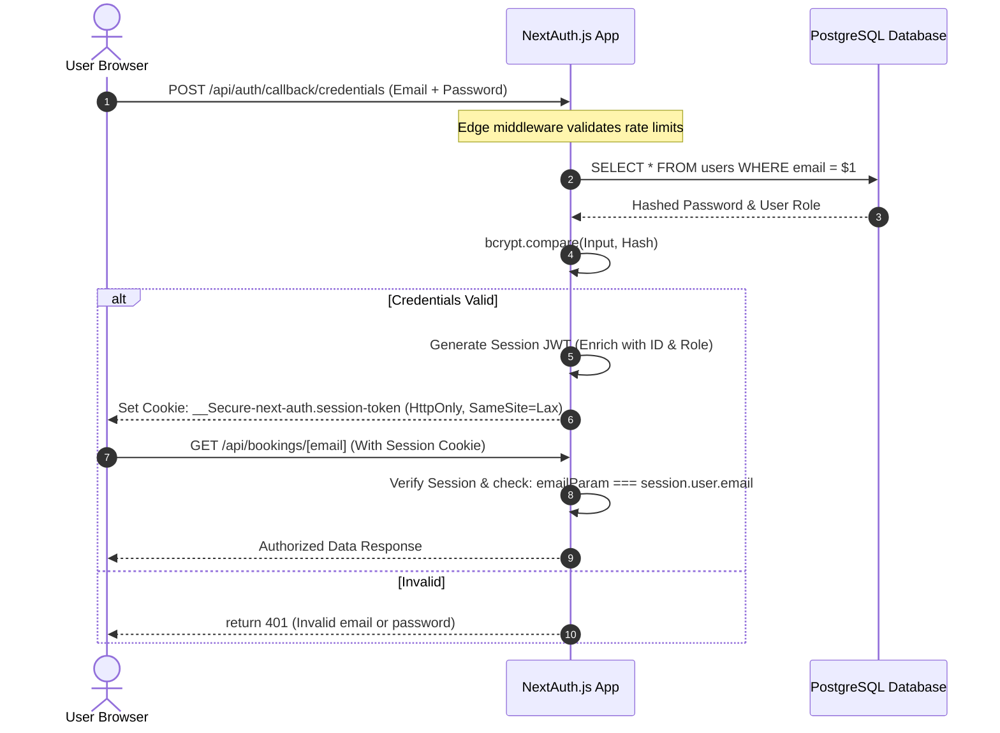
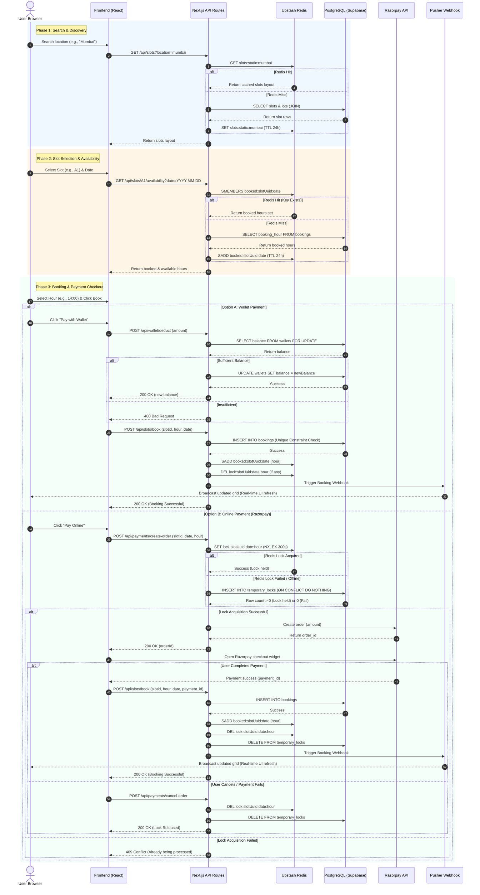

# 🏛️ Smart Parking System — Architecture, Flows & Security Guide

This document provides a detailed breakdown of the system architecture, authentication, caching strategy, booking transactions, payment gateway integration, rate limiting, and security mechanisms designed and integrated within the application.

---

## 📋 Table of Contents
1. [🔐 Authentication & Session Flow](#1-authentication--session-flow)
2. [🚗 The Booking & Payment Lifecycle (Search to Success)](#2-the-booking--payment-lifecycle-search-to-success)
3. [⚡ Redis Caching Strategy & Data Structures](#3-redis-caching-strategy--data-structures)
4. [🐘 PostgreSQL Concurrency, Transactions & Locking](#4-postgresql-concurrency-transactions--locking)
5. [📊 Operations & Time Complexity Analysis](#5-operations--time-complexity-analysis)
6. [🛡️ Cyber-Attack Defense Mechanisms](#6-cyber-attack-defense-mechanisms)

---

## 1. 🔐 Authentication & Session Flow

The application utilizes **NextAuth.js** (v4) to manage user identity. It supports three authentication channels:
1. **Credentials Provider:** Conventional email & password verification.
2. **Google OAuth 2.0:** Single sign-on authentication through Google.
3. **GitHub OAuth 2.0:** Single sign-on authentication through GitHub.

### 🔄 The Authentication Pipeline



### 🔑 Key Design Details:
* **Session Strategy:** JSON Web Tokens (JWT) signed with `NEXTAUTH_SECRET` are used. No session state is held on the server; the token is stored inside a secure cookie.
* **Cookie Security:** The token cookie has `HttpOnly` enabled (preventing client-side JavaScript access to block XSS attacks) and utilizes `SameSite=Lax` to prevent Cross-Site Request Forgery (CSRF).
* **Role Verification:** User roles (`user`, `admin`) are populated from the DB during login and stored in the JWT payload. Gated routes (such as admin top-ups) verify `session.user.role === 'admin'` before fulfilling API requests.

---

## 2. 🚗 The Booking & Payment Lifecycle (Search to Success)

The slot booking process consists of three main phases: **Search & Discovery**, **Slot Selection & Availability**, and the **Booking Transaction** (via digital Wallet or Online UPI/Card payment).

### 🔄 End-to-End Booking Sequence



---

## 3. ⚡ Redis Caching Strategy & Data Structures

To handle high traffic, prevent double-bookings, and minimize database load, the system utilizes **Upstash Redis** (via HTTP REST to prevent connection exhaustion in serverless environments).

### 🗃️ Redis Data Structures Used

| Redis Key Pattern | Data Structure | Purpose | TTL | Why it is Fast |
|:---|:---|:---|:---|:---|
| `slots:static:${location}` | **String (JSON)** | Caches the static layout, names, addresses, and pricing of slots in a city. | 24 Hours (`86400s`) | **In-memory Key-Value Lookup ($O(1)$):** Avoids performing heavy SQL `LEFT JOIN` operations between `parking_slots` and `parking_lots` on every search. |
| `booked:${slotUuid}:${date}` | **Set (integers)** | Stores the hour blocks (0–23) already booked for a specific slot on a specific date. | 24 Hours (`86400s`) | **In-memory Set Operations ($O(1)$):** Checking if a slot is booked (`SISMEMBER`) or retrieving all booked hours (`SMEMBERS`) is extremely fast, bypassing SQL index scans. |
| `lock:${slotUuid}:${date}:${hour}` | **String** | Acts as a short-lived distributed lock for a specific slot hour during payment checkout. | 5 Minutes (`300s`) | **Atomic Key Writing ($O(1)$):** Uses the `NX` (Set-If-Not-Exists) and `EX` (Expiration) flags to guarantee atomic lock acquisition at the application layer. |

---

## 4. 🐘 PostgreSQL Concurrency, Transactions & Locking

While Redis provides high-performance caching and fast rate limiting, **PostgreSQL (Supabase)** acts as the single source of truth, enforcing ACID guarantees and data consistency.

### 🔒 Two-Phase Locking Strategy

#### Phase A: The 5-Minute Checkout Hold (Pessimistic/Distributed Lock)
When a user clicks "Pay Online" and is redirected to the Razorpay widget, we must temporarily reserve the slot for **5 minutes** so no one else can purchase it.
* **The Serverless Constraint:** We cannot keep a PostgreSQL transaction block (`BEGIN` ... `FOR UPDATE`) open for 5 minutes waiting for the user to type their card details. Doing so would starve the database connection pool, block all other database queries, and crash the system.
* **The Solution:** 
  1. We first try to write a lock in Redis using `redis.set(lockKey, email, { nx: true, ex: 300 })`.
  2. If Redis is offline, we fall back to writing a row in the `temporary_locks` table containing `slot_id`, `booking_date`, `booking_hour`, and `expires_at` (set to `now() + interval '5 minutes'`).
  3. A database unique constraint on `(slot_id, booking_date, booking_hour)` ensures that only one checkout hold can exist. If a duplicate insert is attempted, PostgreSQL rejects it (`ON CONFLICT DO NOTHING`), returning a `409 Conflict` to the second user.
  4. If the payment is completed, the lock is deleted. If the payment is cancelled, the lock is deleted. If the user abandons the checkout, the Redis lock automatically expires in 5 minutes, and any PostgreSQL fallback lock row is ignored or purged.

#### Phase B: Uniqueness Constraints & Row-Level Locking
Once the payment succeeds, the booking is confirmed and inserted. This query completes in **milliseconds** and relies on PostgreSQL's index locks and transaction safety:

1. **Unique Index Constraint:**
   The `bookings` table has a unique composite index on:
   ```sql
   UNIQUE (slot_id, booking_date, booking_hour)
   ```
   If two concurrent booking requests bypass the application layer locks (e.g., during extreme network latency), the database engine uses its internal B-Tree index locks to serialize the insertions. The first insertion succeeds, and the second fails with a unique key violation, triggering a clean rollback.

2. **Wallet Balance Deduction (Double-Spend Protection):**
   To prevent a user from double-spending their wallet balance via rapid concurrent clicks, the balance deduction should be wrapped in a transaction with row-level locking:
   ```sql
   BEGIN;
   -- Lock the wallet row for this user in PG shared memory
   SELECT balance FROM wallets WHERE email = $1 FOR UPDATE;
   -- Perform validation and update
   UPDATE wallets SET balance = $2 WHERE email = $1;
   COMMIT;
   ```
   The `FOR UPDATE` clause ensures that any concurrent transaction trying to read or write the same wallet row is blocked until the first transaction commits, preventing race conditions.

---

## 5. 📊 Operations & Time Complexity Analysis

Below is the time complexity breakdown of the operations involved in the booking pipeline:

| Step | Operation | Target Store | Query / Command | Time Complexity | Rationale |
|:---|:---|:---|:---|:---|:---|
| **1. Search** | Search Slots by City | Redis (Hit)<br>PostgreSQL (Miss) | `GET slots:static:location`<br>`SELECT ... WHERE location = $1` | $O(1)$<br>$O(\log M + N)$ | Redis lookup is $O(1)$. DB lookup uses a B-tree index on `location` ($O(\log M)$ where $M$ is total slots) and returns $N$ slots. |
| **2. Select** | Get Booked Hours | Redis (Hit)<br>PostgreSQL (Miss) | `SMEMBERS booked:slotUuid:date`<br>`SELECT booking_hour WHERE ...` | $O(1)$<br>$O(\log B + K)$ | Redis set retrieval is $O(K)$ where $K \le 24$ (effectively $O(1)$). DB uses index scan on `(slot_id, date)` ($O(\log B)$ where $B$ is total bookings). |
| **3. Lock** | Acquire Checkout Lock | Redis (Primary)<br>PostgreSQL (Fallback) | `SET lock:key email NX EX 300`<br>`INSERT INTO temporary_locks` | $O(1)$<br>$O(\log L)$ | Redis `SET NX` is atomic $O(1)$. PostgreSQL insert checks unique index constraint ($O(\log L)$ where $L$ is active locks). |
| **4. Deduct** | Wallet Balance Update | PostgreSQL | `SELECT ... FOR UPDATE`<br>`UPDATE wallets` | $O(\log W)$ | B-Tree index lookup on `email` ($O(\log W)$ where $W$ is total wallets) with a row-level write lock. |
| **5. Confirm**| Insert Final Booking | PostgreSQL | `INSERT INTO bookings` | $O(\log B)$ | Inserts row and updates the unique composite index ($O(\log B)$). |
| **6. Publish**| Real-time UI Update | Pusher | Trigger Webhook Event | $O(1)$ | Non-blocking HTTP POST request to Pusher API. |

---

## 6. 🛡️ Cyber-Attack Defense Mechanisms

### 💉 SQL Injection (SQLi)
* **Defense:** Raw input strings are never interpolated directly into queries. We use parameterized placeholders (`$1, $2`).
* **Example:** `SELECT * FROM users WHERE email = $1` instead of `"SELECT * FROM users WHERE email = '" + email + "'"`

### 🪓 Cross-Site Scripting (XSS)
* **Defense:** React handles automatic output HTML encoding on values injected into JSX templates. 
* **Defense:** Implemented a strict **Content Security Policy (CSP)** inside `next.config.mjs` which forbids unapproved third-party scripts or injected inline script elements from executing.

### 🛡️ IDOR (Insecure Direct Object Reference)
* **Defense:** We do not trust request parameters (like `/api/user/[email]`) at face value.
* **Verification:** The backend decodes the secure session JWT cookie, checks if `session.user.email === targetEmail`, and throws a `403 Forbidden` if a user tries to query someone else's metadata.

### 📄 LLM/RAG Prompt Injection & Abuse
* **Defense:** Input string sizes on support inquiries are capped at **300 characters** in validation checks to block long jailbreak prompts.
* **Defense:** Rate-limited at 5 attempts per 15 minutes per IP to prevent token generation cost hikes and API spam.
